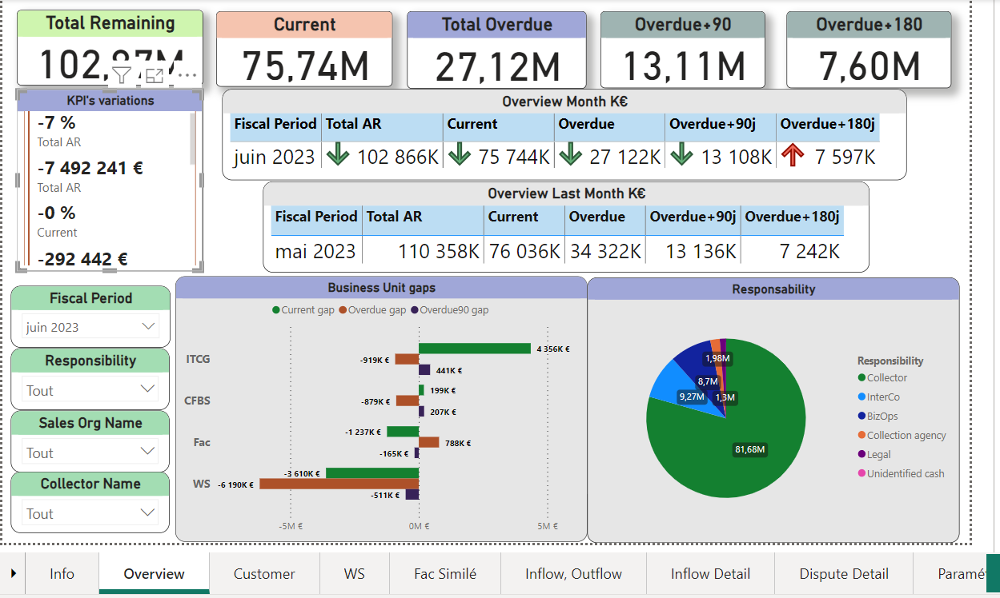
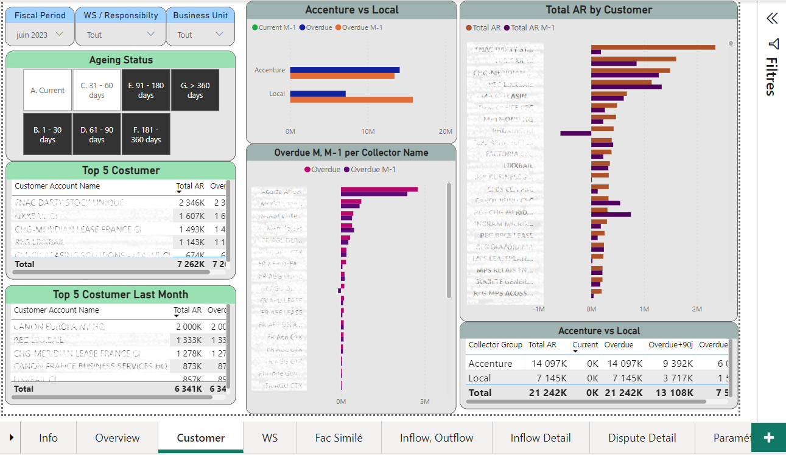

# 💳 Dashboard - Analyse des créances clients

> 📍 Projet réalisé en entreprise dans le cadre d'une mission en tant que Consultante Data Analyst finance (service Crédit & Recouvrement)

---

## 🎯 Objectif

Ce dashboard a été conçu pour fournir aux équipes du service Crédit & Recouvrement une **vue consolidée et dynamique** des créances clients, afin de :

- Suivre les **encours clients** par segment, région et type de client
- Identifier les **retards de paiement** par tranche d’échéance
- Prioriser les **actions de recouvrement**
- Faciliter les échanges avec les équipes commerciales et comptables
- Traitement efficaces des litiges 

---

## 🧩 Données et indicateurs clés

> ⚠️ Les données sont confidentielles. Les captures d’écran ci-dessous sont floutées à des fins de démonstration.

**Colonnes principales utilisées :**
- `Client ID`
- `Nom client`
- `Montant total dû`
- `Montant échus`
- `Échéance`
- `Nombre de jours de retard`
- `Agent de recouvrement`
- `Période fiscale`
- `Raisons des litiges`

**Indicateurs développés :**
- 🔴 Montant total en retard
- 🟡 Variations mensuelles du montant 
- 🟢 Regrouppement des clients par agent de recouverement associé
- 🔍 Répartition des créances par tranches d’échéance (0-30j, 30-60j, 60-90j, >90j)

---

## 📊 Aperçus visuels (extraits)

| Vue d’ensemble | Détail par segment |
|----------------|--------------------|
|  |  |

---

## ⚙️ Fonctions techniques

- **Power Query** : transformation des tables de comptabilité et CRM
- **DAX** : mesures pour le suivi des créances échues, retards dynamiques, variations annuelles & mensuelles %
- **Filtres synchronisés** pour navigation fluide par région / péridode fiscale / litige / agent responsable
- **Bookmarks** pour vues par tranche de retard
- **Alertes visuelles** via code couleur automatique / sympoles (fléches)

---

## 🧠 Compétences mobilisées

- Analyse métier dans un contexte financier réel
- Traitement de données multi-source (ERP, fichiers Excel, base de données oracle)
- Construction d’un modèle relationnel optimisé sur Power Pivot
- Maîtrise de DAX et Power Query
- Communication avec les métiers (finance, recouvrement, contrôle de gestion)
- Publication et actualisation automatique sur Power bi Service 

---

## 🚀 Impact du projet

✅ Mise en place d’un reporting automatisé partagé chaque mois avec les équipes de recouvrement  
✅ Gain de temps estimé à 2h / jour pour l’équipe  
✅ Meilleure réactivité sur les retards de paiement à +90j
✅ Visibilité sur les litiges et contournemment des problémes liées aux factures impayés 

---

📫 Me contacter : **[mel.bourrai2019@gmail.com]**
